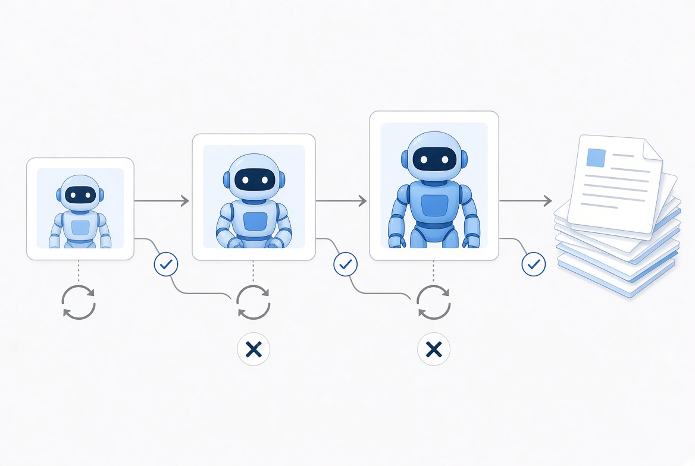
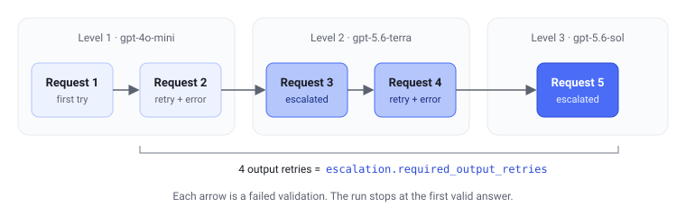

Most requests in an extraction pipeline don't need a frontier model. A cheap model reads the invoice, pulls out the line items and the total, and gets it right. The interesting part is the rest: the answers where the lines don't add up to the total, the vendor isn't in the database, the date is in the future.

Output validators catch those. The question is what happens next.

The policy I wanted is simple to state:

1. Try the cheap model.
2. If validation fails, let the same model retry, and show it the error.
3. If it still fails, move to a stronger model, and show it what went wrong before.



Step 2 is cheap and fixes a surprising share of failures: a model told "the lines add up to 30, but the total is 99" usually corrects itself. Step 3 is what keeps the pipeline from failing on the inputs that are genuinely hard. Frontier pricing gets paid only for those.

I use [Pydantic AI](https://ai.pydantic.dev/), and it turned out that this policy, as obvious as it sounds, can't be assembled from what the framework ships. So I built it as a small package: [`pydantic-ai-escalation`](https://pypi.org/project/pydantic-ai-escalation/). This article is about why the existing pieces don't fit, the decisions behind the package, and the things tests taught me along the way.

## Two mechanisms that each do half

Pydantic AI has two relevant tools.

**`ModelRetry`** from an output validator sends the error back to the model and asks again. That's step 2. But it always asks the same model.

**`FallbackModel`** tries a list of models in order. By default it moves on when a provider returns an error, and you can also give it a handler that inspects each response and rejects it. That looks like step 3, with two catches I confirmed with scripted test models before writing any code:

- A rejected response is thrown away. The next model gets the original request and never learns why the previous answer was rejected.
- Every retry is a new request, and `FallbackModel` starts each request from its first model. Combine it with `ModelRetry` and the run keeps retrying the cheapest model until the retry budget is spent, never reaching the stronger ones.

Neither of these is a bug. `FallbackModel` is built for availability: the provider is down, try another one. What I needed is escalation for quality, and that's a different job.


## A capability, not a model wrapper

Pydantic AI has an extension mechanism called capabilities: small objects that plug into the agent's lifecycle. One of the things a capability can do is choose the model for each request step. The framework calls this selector before every request, before anything is prepared for a specific model, and gives it the message history.

That's the right place for escalation. I considered two alternatives:

- **Wrapping the model.** A model sees one request at a time. It has no idea whether this is the first attempt or the third one after two validation errors.
- **Swapping the model in a later hook.** By then the request has already been prepared for the originally chosen model: tool schemas, output mode. Switching to a model from another provider at that point risks sending it parameters it doesn't support.

So the package is a capability, `EscalateOnOutputRetry`, with an ordered list of levels. Each level is a model plus the number of feedback retries it gets:

```python
from pydantic_ai import Agent
from pydantic_ai_escalation import EscalateOnOutputRetry, Level

escalation = EscalateOnOutputRetry(
    levels=[
        Level('openai:gpt-4o-mini', output_retries=1),
        Level('openai:gpt-5.6-terra', output_retries=1),
        Level('openai:gpt-5.6-sol'),
    ]
)

agent = Agent(
    output_type=Invoice,
    capabilities=[escalation],
    retries={'output': escalation.required_output_retries},
)
```

With these levels, a run makes at most five requests: two on the cheap model, two on the middle one, one on the strongest. It stops at the first answer that passes validation. The stronger models see every earlier attempt and its error, so they know what didn't work.



The same configuration fits in a YAML agent spec, which means the escalation policy can be tuned without touching code:

```yaml
retries:
  output: 4
capabilities:
  - EscalateOnOutputRetry:
      levels:
        - {model: openai:gpt-4o-mini, output_retries: 1}
        - {model: openai:gpt-5.6-terra, output_retries: 1}
        - {model: openai:gpt-5.6-sol}
```

## "Count the failures" is harder than it sounds

The whole capability rests on one number: how many times has output validation failed in this run? My first prototype counted every retry in the history. Tests showed it was wrong in three ways.


**Tool retries aren't output failures.** An agent that calls tools gets retries from them too: a lookup found nothing, an argument was malformed. That says nothing about whether the model can produce a valid answer. Counting those would escalate tool-heavy agents for no reason, burning through the levels before the model had even tried to answer.

**Earlier runs aren't this run.** When a conversation continues with message history, the old failures are still in it. Counting them would start the second conversation straight on the expensive model. The package only counts entries that belong to the current run.

**Output retries can look exactly like tool retries.** With structured output, Pydantic AI asks the model to return its answer through a special output tool. A failed validation is then recorded as a retry of that tool, and in the history it's indistinguishable from a retry of a regular tool. The capability records the output tools' names and uses them to tell the two apart.

There was a fourth problem waiting in the future. An approved change in Pydantic AI ([#8094](https://github.com/pydantic/pydantic-ai/pull/8094)) replaces the class that records retries with new ones. Code that looks for the old class would find nothing after that release: the failure count would stay at zero, and escalation would silently turn off. Every request would go to the cheapest model and the pipeline would look like it works. The package recognizes both formats, so it keeps working through the change.

## The budget the capability can't set

Pydantic AI stops a run once it has used up its output retry budget, which defaults to one retry. A too-small budget makes the upper levels unreachable, which defeats the whole point.

A capability has no public way to raise that budget. So the package does the next best thing: `required_output_retries` computes the budget that reaches every attempt on every level, and when the capability can see the budget (with structured output) and it's too small, it warns. With plain text output no hook exposes the budget, so the README says so plainly instead of implying a safety net that isn't there.

## What tests taught me

Two findings came from tests, not from reading documentation, and both would have been painful in production.

**A typo in the config was silently ignored.** Write `retries: 1` instead of `output_retries: 1` in the YAML spec, and Pydantic AI's spec loader drops the unknown key without complaint. The level ends up with zero feedback retries, and the only symptom is a bill higher than expected. The package now rejects unknown fields with a clear error.

**`run_stream()` can't escalate.** Pydantic AI has several ways to stream. `run_stream_events()` and `run()` with an event handler stream every response and still retry validation, so escalation works as usual. `run_stream()` is different: once output has been streamed to the caller, it can't be taken back, so the first invalid output fails the run. There is never a second request, so there's nothing to escalate. This is documented as a limitation rather than discovered by users the hard way.

## Seeing how often the cheap model is enough

The most useful question to ask of this setup in production is how often escalation actually happens. When instrumentation is on, each escalation emits one span with the level it moved from, the level it moved to, and the model. Requests that stay on the same level emit nothing extra, since the framework already traces them. That's enough to see what share of inputs the cheap model handles on its own, which is the number that justifies the whole design.

That number is also the honest test of the idea. If the cheap model resolves most inputs by itself, escalation saves real money. If it rarely does, the extra attempts only add latency, and it's better to start on a stronger level. The spans make that visible, and the levels live in YAML, so moving the starting point is a config change.

## What's next

The package is published and works today: `pip install pydantic-ai-escalation`. The source, tests, and a document explaining every design decision are on [GitHub](https://github.com/teterevlev/pydantic-ai-escalation).

I've also proposed it for [Pydantic AI Harness](https://github.com/pydantic/pydantic-ai-harness), the official capability library, in [issue #1139](https://github.com/pydantic/pydantic-ai-harness/issues/1139). Building it surfaced two gaps in the framework's API that are worth discussing regardless of where the capability ends up. The model selector can't see how many output retries a run has used, so it has to reconstruct that from the history. And a capability can't declare the retry budget it needs.

## The broader point

In an earlier post I argued that most tasks don't need the smartest model: they need a good decomposition into simple, checkable steps, where a cheap model does the work and validators check it. This package is the other half of that argument. Validators don't only catch errors; they're the signal that tells the system when a step is genuinely hard. A good architecture spends frontier-model money exactly there, and nowhere else.

The next question is what happens when a model, or a whole provider, isn't there at all. That's about safety margins, and it's the subject of the next article.